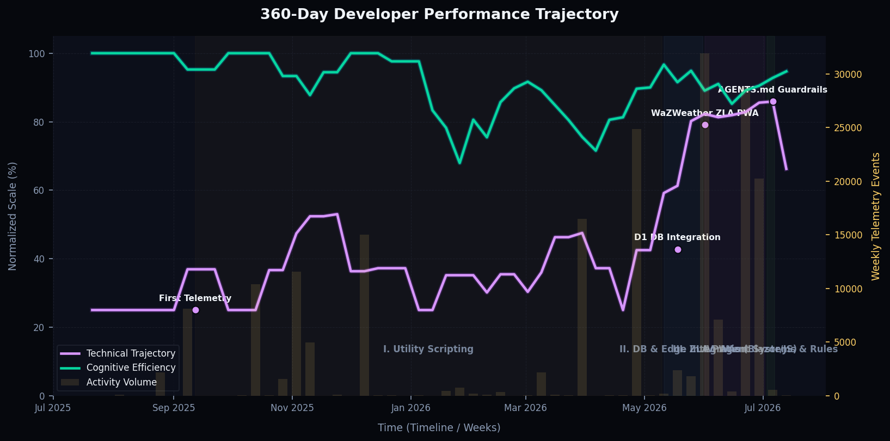

# Workspace Cognitive & Performance Odometer

## 📊 Developer Performance Trajectory (360-Day Lookback)

## 📊 Mathematical Performance Metrics
| Metric | Value | Description |
| :--- | :--- | :--- |
| **Active Development Time** | `0.0 hours` | Total duration of active work blocks |
| **Work Block Odometer** | `4 sessions` | Total count of distinct sessions sessionized |
| **Friction Time / Fight** | `0.0 hours` | Active duration spent blocked/aborted |
| **Friction Ratio** | `0.0%` | Percentage of total active time spent fighting system blocks |
| **Action Density / Velocity** | `0.0 edits/hour` | Rate of file modifications per active hour |
| **Compute Burn Estimate** | `0 tokens` | Estimated API/Local LLM token burn |

## Executive Summary
Over the last 24 hours, the operator logged 4 sessions totaling 0.0 hours of active execution time. The session density was 0.0 edits/hour with a friction ratio of 0.0%.

## Active Blocker Loops
No active blocker loops detected.

## Work Sessions Narrative

### [Session 4] - Completed
- **Time Range**: 2026-07-17 16:44:11 to 2026-07-17 16:44:11 (0s)
- **Primary Intent**: No specific intent logged.
- **Outcome / End State**: Brief interaction executed.
- **Files Modified**: `None`

### [Session 3] - Completed
- **Time Range**: 2026-07-17 06:21:12 to 2026-07-17 06:21:12 (0s)
- **Primary Intent**: No specific intent logged.
- **Outcome / End State**: Brief interaction executed.
- **Files Modified**: `None`

### [Session 2] - Completed
- **Time Range**: 2026-07-17 00:31:15 to 2026-07-17 00:31:22 (7.0s)
- **Primary Intent**: No specific intent logged.
- **Outcome / End State**: Work block executed successfully.
- **Files Modified**: `None`

### [Session 1] - Completed
- **Time Range**: 2026-07-16 23:27:20 to 2026-07-16 23:27:20 (0s)
- **Primary Intent**: No specific intent logged.
- **Outcome / End State**: Brief interaction executed.
- **Files Modified**: `None`
